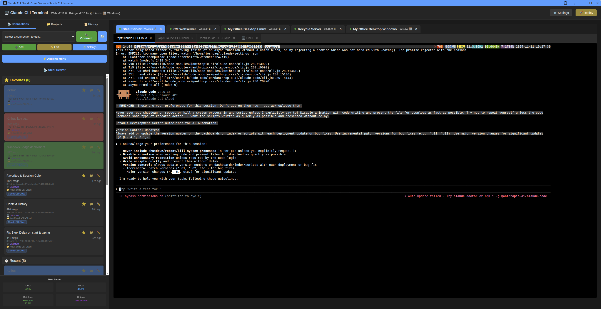
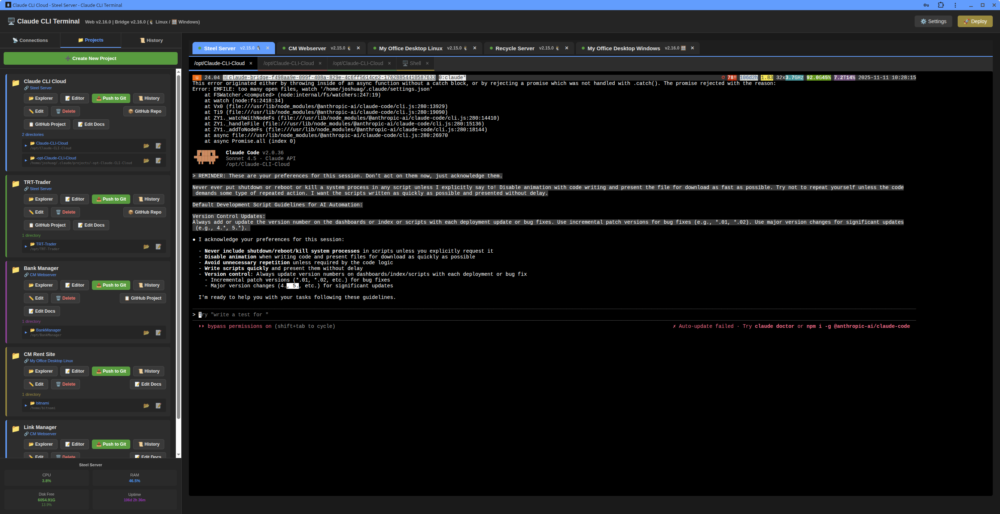
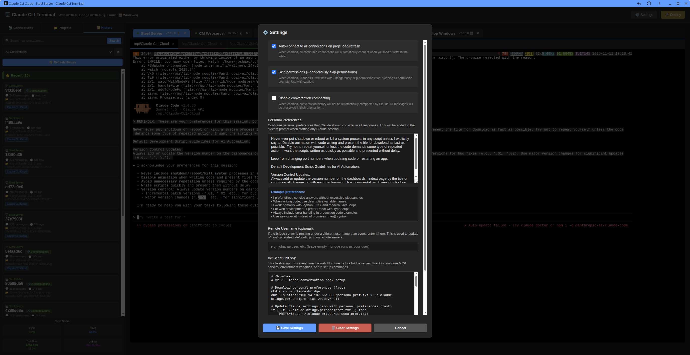
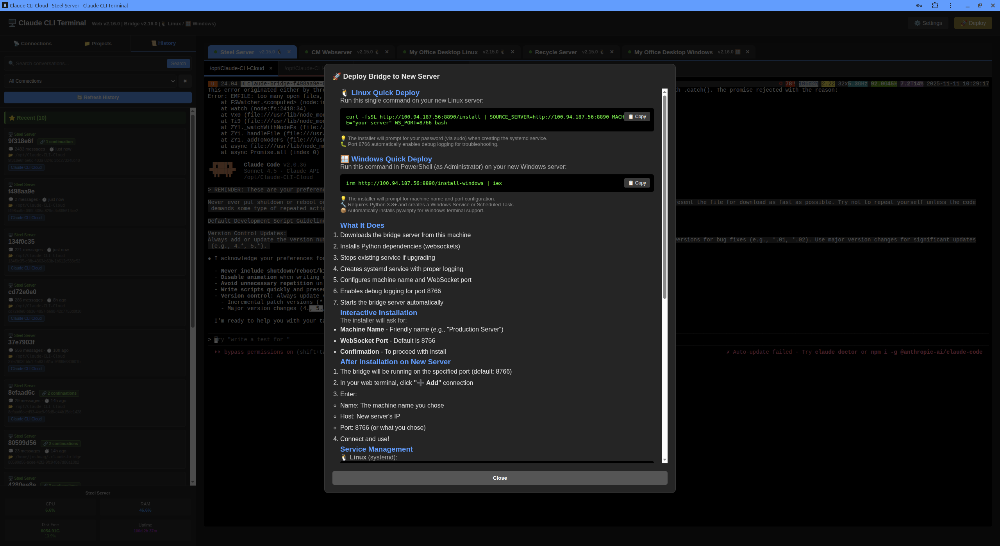

# Remote Claude CLI Chat System

**Version:** 1.0

A web-based chat interface that allows you to chat with Claude in a browser while the actual Claude CLI execution happens on remote machines. Manage multiple machines, switch between them seamlessly, and automatically discover and organize existing Claude CLI sessions by project and directory.

## Features

- 🌐 **Web-Based Interface**: Chat with Claude from any browser
- 🖥️ **Multi-Machine Support**: Connect and switch between multiple remote machines
- 🪟 **Windows Support**: Full Windows bridge server support with automated installer
- 🔌 **MCP Tools & AI Context Server**: Multi-mode context server (in development) for intelligent session and project awareness
- 📁 **Session Discovery**: Automatically find and organize existing Claude CLI sessions
- 🗂️ **Project Organization**: Sessions grouped by project and directory
- ⚡ **Real-Time Streaming**: See Claude's responses as they're generated
- 📎 **File Attachments**: Upload and attach files to your conversations
- 🔧 **Tool Use Display**: See when Claude uses tools with formatted output
- 💾 **Session Continuity**: Load and continue existing conversations
- 🔍 **Search & Filter**: Quickly find sessions across all your projects

## Architecture

```
Web Browser (Chat UI)
    ↓ WebSocket
Bridge Server (Python)
    ↓ Anthropic API
Claude AI
    ↓ Session Storage
~/.claude/ (Claude CLI Home)
```

## Requirements

### Bridge Server (Remote Machine)

- Python 3.7 or higher
- Claude CLI installed (optional, for session discovery)
- Anthropic API key
- **Windows Support**: Includes PowerShell installer for Windows machines

### Web Interface (Your Computer)

- Modern web browser (Chrome, Firefox, Safari, Edge)
- Network access to bridge server machines

## Installation

### 1. Set Up Bridge Server on Remote Machines

#### Linux/macOS Installation

On each Linux or macOS machine you want to connect to:

```bash
# Navigate to project directory
cd /opt/Claude-CLI-Cloud

# Install Python dependencies
pip install anthropic aiofiles websockets

# Or use pip3 if needed
pip3 install anthropic aiofiles websockets
```

#### Windows Installation

On Windows machines, use the automated PowerShell installer:

```powershell
# Run PowerShell as Administrator
# Set execution policy for this session
Set-ExecutionPolicy Bypass -Scope Process -Force

# Set source server (Linux/macOS machine hosting the files)
$env:SOURCE_SERVER="http://YOUR_SERVER_IP:8890"

# Run installer
.\install-bridge.ps1
```

The Windows installer will:
- Download the bridge server from your source machine
- Install Python dependencies (websockets, aiofiles, psutil, aiohttp, mcp, pywinpty)
- Create a Windows Service or Scheduled Task to run at startup
- Configure MCP server integration (optional)
- Set up firewall rules (if needed)

**Manual Windows Installation:**

```powershell
# Install Python dependencies
python -m pip install websockets aiofiles psutil aiohttp mcp pywinpty

# Or manually download and place files in:
# C:\ProgramData\claude-bridge\
```

### 2. Configure API Key

Set your Anthropic API key as an environment variable:

```bash
# Add to your .bashrc or .zshrc for persistence
export ANTHROPIC_API_KEY="your-api-key-here"

# Or pass it as a command-line argument when starting the server
```

### 3. Start Bridge Server

#### Linux/macOS

```bash
# Basic usage
python3 claude-bridge-server-terminal.py --machine-name "My Machine"

# With custom port
python3 claude-bridge-server-terminal.py --machine-name "Work Laptop" --port 8766

# With custom host (bind to specific IP)
python3 claude-bridge-server-terminal.py --machine-name "Server" --host 192.168.1.100 --port 8766

# With API key as argument
python3 claude-bridge-server-terminal.py --machine-name "Server" --api-key "your-key"

# With custom Claude home directory
python3 claude-bridge-server-terminal.py --machine-name "Server" --claude-home "/custom/path/.claude"
```

#### Windows

If you used the PowerShell installer, the bridge server is already running as a service. To manage it:

```powershell
# Check service status (if using NSSM)
nssm status ClaudeBridge

# Or check scheduled task (if using Task Scheduler)
Get-ScheduledTask -TaskName ClaudeBridge | Get-ScheduledTaskInfo

# Stop service
nssm stop ClaudeBridge
# Or: Stop-ScheduledTask -TaskName ClaudeBridge

# Start service
nssm start ClaudeBridge
# Or: Start-ScheduledTask -TaskName ClaudeBridge

# View logs
Get-Content C:\ProgramData\claude-bridge\bridge.log -Wait
```

**Manual Windows Start:**

```powershell
# Basic usage
python claude-bridge-server-terminal.py --machine-name "My Windows PC"

# With custom port
python claude-bridge-server-terminal.py --machine-name "Windows Laptop" --port 8766
```

**Command-Line Arguments:**

- `--machine-name` (required): Friendly name for this machine
- `--host` (default: 0.0.0.0): Host to bind to
- `--port` (default: 8765): Port to listen on
- `--api-key` (optional): Anthropic API key (or use ANTHROPIC_API_KEY env var)
- `--claude-home` (default: ~/.claude): Claude CLI home directory

### 4. Open Web Interface

```bash
# Option 1: Open directly in browser
open index.html

# Option 2: Serve via HTTP server (if needed)
python3 -m http.server 8080
# Then visit: http://localhost:8080
```

## User Interface Overview

### Main Interface



The Claude CLI Cloud interface features a powerful three-panel layout designed for efficient session management and conversation flow:

#### **Left Navigation Panel**

The left sidebar provides comprehensive session organization and quick access controls:

**Connection Tabs**
- Switch between multiple connected machines (Steel Server, CM Webserver, Recycle Server, etc.)
- Each connection shows real-time status and version information
- Color-coded tabs for easy visual identification

**Action Menu** (⚡ Actions Menu button)
- **Add**: Create new connections to bridge servers
- **Edit**: Modify existing connection settings
- **Settings**: Configure global application preferences and personal preferences

**Favorites Section** (⭐ Favorites)
- Pin important sessions for quick access
- Star icon on each session to add/remove from favorites
- Sessions remain accessible across all connections
- Empty state message guides new users
- Shows session count: "Favorites (6)"

**Project-Based Organization**
- Sessions automatically grouped by project
- Color-coded project cards with expandable/collapsible sections
- Each project shows:
  - Project name and working directory
  - Quick action buttons (Explorer, Editor, Push to Git, History)
  - Session count and last activity
  - Directory structure within projects

**Context History**
- Recent session access history
- Quick navigation to previously opened sessions
- Timestamp and project information

**Recent Sessions** (🕐 Recent)
- Last 5 accessed sessions
- Quick reload capability
- Session metadata preview

**System Information** (Bottom of sidebar)
- Real-time CPU and RAM usage for connected server
- Disk space monitoring
- Visual gauges with percentage indicators

#### **Center Chat Panel**

The main conversation area with:
- Real-time streaming responses from Claude
- Message history with user/assistant distinction
- Code blocks with syntax highlighting
- Tool use notifications
- Error handling and status messages
- Input area with file attachment support

#### **Top Connection Bar**

- Active connection indicator
- Connection tabs for switching between machines
- Settings button (⚙️)
- Deploy button (📦) for bridge server deployment

### Projects View



The Projects tab provides advanced project management:

**Project Cards**
Each project displays as an organized card with:
- **Color-coded headers** for visual organization
- **Quick Action Buttons**:
  - 🔍 **Explorer**: Browse project file structure
  - ✏️ **Editor**: Edit project files with integrated editor
  - 📤 **Push to Git**: Push changes with Git Exclusions support
  - 📜 **History**: View git commit history
  - 📝 **Edit Docs**: Edit README, SECURITY.md, CONTRIBUTING.md, LICENSE, .gitignore, CHANGELOG.md

**Project Features**:
- GitHub repository integration
- GitHub Project board links
- Working directory management
- Session auto-discovery based on working directory
- Expandable session lists within each project

**Create New Project**
- Button to add new project configurations
- Assign directories and repositories
- Configure Git exclusions and tokens
- Set project colors and descriptions

### Settings Modal



Comprehensive settings interface with:

**Auto-Connect Options**
- ✅ Auto connect to all connections on page load/refresh
- Automatically restores your connection state

**Dangerous Permissions**
- ⚠️ Skip permissions for dangerously-skip-permissions flag
- Allows Claude CLI to run with elevated capabilities
- Use with caution

**Conversation Compacting**
- Disable automatic conversation compacting
- Controls how Claude handles long conversation histories

**Personal Preferences**
- Free-form text area for custom preferences
- Automatically included in all prompts
- Persists across sessions
- Examples:
  - Development script guidelines
  - Version control preferences
  - Code style requirements
  - Default behaviors and workflows

**Remote Username**
- Configure username for remote operations
- Used for bridge server interactions

**Init Script Configuration**
- Bash script that runs every time the UI connects to a bridge server
- Useful for MCP servers, environment setup, or startup commands
- Example uses:
  - Starting conversation hook scripts
  - Configuring environment variables
  - Running setup commands

**Save & Clear Buttons**
- 💾 Save Settings - Persists all configurations
- 🗑️ Clear Settings - Resets to defaults

### Deploy Modal



Automated bridge server deployment with platform-specific installers:

**Linux Quick Deploy**
- One-line installation command
- Automatically configures SOURCE_SERVER environment variable
- Downloads and installs dependencies
- Sets up systemd service

**Windows Quick Deploy**
- PowerShell installation script
- Administrator mode instructions
- Creates Windows Service or Scheduled Task
- Handles Python dependencies automatically

**What It Does**
1. Downloads bridge server from source machine
2. Installs Python dependencies (websockets, aiofiles, etc.)
3. Stops existing service if upgrading
4. Creates systemd service with proper logging
5. Configures machine name and WebSocket port
6. Enables debug logging for port 8766
7. Starts the bridge server automatically

**Interactive Installation**
- Prompts for machine name (e.g., "Production Server")
- WebSocket port selection (default: 8766)
- Confirmation before proceeding

**Service Management**
After installation, bridge server runs as a system service:
- **Linux**: `systemctl status claude-bridge`
- **Windows**: `nssm status ClaudeBridge` or Task Scheduler

## Usage Guide

### First Time Setup

1. **Open the web interface** - The setup panel will appear automatically
2. **Download bridge server** - Click "Download claude-bridge-server.py" (already done if you cloned this repo)
3. **Add a machine**:
   - Enter a friendly name (e.g., "Work Laptop")
   - Enter WebSocket URL (e.g., `ws://192.168.1.100:8765`)
   - Click "Add Machine"
4. **Connect** - Click the machine button in the top bar to connect

### Managing Machines

- **Add Machine**: Click "Settings" button → Fill in form → Add Machine
- **Remove Machine**: Click "Settings" → Click "Remove" next to machine
- **Switch Machines**: Click machine buttons in the top bar
- **Status Indicators**: Green dot = online, Red dot = offline

### Working with Sessions

#### Discovering Sessions

Sessions are automatically discovered when you connect to a machine. They're organized by:

- **Projects**: Top-level folders from `~/.claude/projects/`
- **Directories**: Working directories within each project
- **Ungrouped**: Sessions not associated with a project

#### Loading Sessions

1. Navigate the sidebar tree view
2. Expand projects and directories (click arrow icons)
3. Click on any session to load it
4. The full conversation history will appear in the chat area

#### Creating New Sessions

1. Click "+ New Session" button in sidebar
2. Optionally select a project from the dropdown
3. Optionally enter a working directory
4. Start typing your message

#### Session Information

The session info bar shows:
- Current project name
- Working directory
- Session ID

### Chatting with Claude

#### Basic Chat

1. Type your message in the textarea
2. Press Enter to send (or click Send button)
3. Use Shift+Enter for new lines
4. Wait for Claude's response

#### Attaching Files

1. Click "📎 Attach Files" button
2. Select one or more files
3. Files appear as chips below the button
4. Click × on chip to remove a file
5. Send message with files attached

#### Tool Use Display

When Claude uses tools (in supported modes), you'll see:
- 🔧 Tool name and input parameters
- Formatted display in code blocks
- Clear visual separation from regular messages

### Search & Filter

Use the search box in the sidebar to filter sessions by:
- Message preview text
- Project name
- Directory path

Type your query and sessions update in real-time.

### Tips & Tricks

- **Quick Send**: Press Enter (Shift+Enter for newlines)
- **Refresh Sessions**: Click ⟳ button to rescan for new sessions
- **Clear Chat**: Click "+ New Session" to start fresh
- **Multiple Files**: Select multiple files at once for attachment
- **Session Context**: Claude remembers the full conversation history when you load a session

## Network Configuration

### Local Network (Same WiFi/LAN)

```bash
# On remote machine, find your IP address
ip addr show  # Linux
ifconfig      # macOS

# Start bridge server
python3 claude-bridge-server.py --machine-name "My Machine" --host 0.0.0.0 --port 8765

# In web interface, add machine with:
# URL: ws://192.168.1.XXX:8765
```

### Internet Access

#### Option 1: Port Forwarding

Configure your router to forward external port to internal machine:
- External: 8765 → Internal: 192.168.1.100:8765
- Use your public IP: `ws://YOUR_PUBLIC_IP:8765`

#### Option 2: Tunneling Service (Recommended)

**Using ngrok:**

```bash
# Install ngrok: https://ngrok.com/download

# Start bridge server
python3 claude-bridge-server.py --machine-name "My Machine"

# In another terminal, create tunnel
ngrok tcp 8765

# Use the ngrok URL in web interface:
# ws://0.tcp.ngrok.io:12345
```

**Using Tailscale (VPN):**

```bash
# Install Tailscale: https://tailscale.com/download

# Start tailscale on both machines
tailscale up

# Use Tailscale IP in web interface:
# ws://100.x.y.z:8765
```

### Firewall Configuration

Ensure the bridge server port is open:

```bash
# Ubuntu/Debian
sudo ufw allow 8765/tcp

# CentOS/RHEL
sudo firewall-cmd --permanent --add-port=8765/tcp
sudo firewall-cmd --reload

# macOS
# System Preferences → Security & Privacy → Firewall → Firewall Options
# Add Python and allow incoming connections
```

## Session Discovery Details

The bridge server scans these locations:

- `~/.claude/history.jsonl` - Global chat history with metadata
- `~/.claude/projects/*/` - Project-specific session files
- `~/.claude/file-history/` - File version history

**Session Data Structure:**

```json
{
  "projects": {
    "project-name": {
      "directories": {
        "/path/to/dir": [
          {
            "session_id": "abc123",
            "last_modified": "2025-11-03T10:30:00",
            "preview": "First message preview...",
            "message_count": 15
          }
        ]
      }
    }
  },
  "ungrouped": [...]
}
```

## Message Protocol

### Client → Server

```json
// Discover sessions
{"type": "discover_sessions"}

// Load specific session
{"type": "load_session", "session_id": "abc123"}

// Get available projects
{"type": "get_projects"}

// Send chat message
{
  "type": "chat",
  "message": "Your message here",
  "session_id": "abc123",
  "project": "my-project",
  "directory": "/path/to/dir",
  "files": [
    {"filename": "test.py", "content": "print('hello')"}
  ]
}

// Upload file
{
  "type": "upload_file",
  "filename": "example.txt",
  "content": "file contents"
}
```

### Server → Client

```json
// Connection established
{"type": "connected", "machine": "My Machine", "timestamp": "..."}

// Sessions discovered
{"type": "sessions", "data": {...}, "timestamp": "..."}

// Session loaded
{"type": "session_loaded", "session_id": "...", "history": [...]}

// Projects list
{"type": "projects", "data": ["project1", "project2"]}

// Assistant response (complete)
{"type": "response", "message": "...", "tool_uses": [...]}

// Response chunk (streaming)
{"type": "response_chunk", "content": "partial text..."}

// Tool use notification
{"type": "tool_use", "tool_name": "bash", "tool_input": {...}}

// Error
{"type": "error", "message": "Error details"}
```

## Troubleshooting

### Bridge Server Won't Start

**Problem:** `ValueError: API key required`

**Solution:**
```bash
export ANTHROPIC_API_KEY="your-key-here"
# Or pass --api-key argument
```

**Problem:** `ModuleNotFoundError: No module named 'websockets'`

**Solution:**
```bash
pip3 install websockets anthropic aiofiles
```

### Can't Connect from Web Interface

**Problem:** WebSocket connection fails

**Solutions:**
1. Check bridge server is running: `ps aux | grep claude-bridge`
2. Verify port is open: `netstat -an | grep 8765`
3. Check firewall settings
4. Ensure correct IP address and port in URL
5. Try `ws://` not `wss://` (unless using SSL)

### No Sessions Found

**Problem:** Session discovery returns empty

**Solutions:**
1. Check Claude CLI home exists: `ls -la ~/.claude/`
2. Verify you have existing sessions: `ls ~/.claude/projects/`
3. Check permissions: `ls -la ~/.claude/history.jsonl`
4. Confirm Claude home path: Use `--claude-home` argument if custom location

### File Upload Fails

**Problem:** Files too large or wrong encoding

**Solutions:**
1. Check file size (limit: ~10MB recommended)
2. Ensure files are text-based (binary files not supported yet)
3. Check browser console for errors (F12)

## Security Considerations

⚠️ **IMPORTANT SECURITY NOTES:**

1. **No Authentication**: This system has NO authentication. Anyone who can reach the WebSocket port can access your Claude conversations.

2. **Network Security**:
   - Only run on trusted networks
   - Use VPN (like Tailscale) for internet access
   - Consider adding nginx reverse proxy with authentication

3. **API Key Protection**:
   - Never commit API keys to version control
   - Use environment variables
   - Rotate keys regularly

4. **Session Privacy**:
   - Session files may contain sensitive information
   - Ensure proper file permissions: `chmod 700 ~/.claude/`

5. **Future Improvements** (TODO):
   - Add API key authentication to WebSocket
   - Implement SSL/TLS support (wss://)
   - Add user authentication system
   - Rate limiting per client

## Development

### File Structure

```
/opt/Claude-CLI-Cloud/
├── claude-bridge-server.py   # Python WebSocket bridge (700 lines)
├── index.html                 # Web interface (1600+ lines)
└── README.md                  # This file
```

### Extending the System

#### Adding New Message Types

1. **Bridge Server**: Add handler in `route_message()` method
2. **Web Interface**: Add case in `handleWebSocketMessage()` function

#### Customizing UI

- **Colors**: Edit CSS variables at top of `<style>` section
- **Layout**: Modify `.main-container` and child classes
- **Fonts**: Change `font-family` declarations

#### Adding Features

**Example: Add Voice Input**

1. Add HTML button in input area
2. Use Web Speech API in JavaScript
3. Send transcript as regular message

## Performance Notes

- **Session Discovery**: ~100ms for 100 sessions
- **Session Loading**: ~50-200ms depending on size
- **Streaming Latency**: ~50-100ms per chunk
- **Memory Usage**: ~10-50MB per connected client

## Known Limitations

1. **Binary Files**: Not supported for attachment (text only)
2. **Large Files**: Files >10MB may cause issues
3. **Session Creation**: New sessions not yet written back to Claude CLI format
4. **Tool Execution**: Tool use is display-only, not interactive
5. **Multiple Clients**: Each client maintains separate WebSocket connection

## MCP Tools & AI Context Server (In Development)

🚧 **Work in Progress**: We're developing an advanced MCP (Model Context Protocol) Tools & Server system that provides AI context across multiple operational modes.

### Overview

The MCP integration extends Claude CLI Cloud with intelligent context management, allowing Claude to access conversation history, session metadata, and project information through a standardized protocol.

### Planned Features

#### **AI Context Server with Multiple Modes:**

1. **Conversation History Mode**
   - Access to full conversation history across all sessions
   - Search and retrieve past conversations by content, date, or project
   - Semantic search across conversation databases
   - Session analytics and insights

2. **Project Context Mode**
   - Automatic project detection and context switching
   - Project-specific memory and preferences
   - Working directory awareness
   - Git repository integration

3. **Session Management Mode**
   - Create, load, and manage sessions programmatically
   - Session tagging and organization
   - Favorite and pin important sessions
   - Session threading and continuation tracking

4. **File Context Mode**
   - Access to project file structure
   - Read and analyze files within working directories
   - File version history tracking
   - Intelligent file recommendations

5. **System Information Mode**
   - Machine-specific context (CPU, memory, disk usage)
   - Process monitoring and management
   - Network connectivity status
   - Environment variable access

### Current MCP Components

The following MCP components are already available:

- **conversation-mcp-server.py**: MCP server for conversation history access
- **conversation_db.py**: SQLite database for session metadata and favorites
- **conversation-hook.py**: Hooks for tracking conversation events

### MCP Configuration

MCP servers are configured in `~/.config/claude/mcp_config.json`:

```json
{
  "mcpServers": {
    "conversation-history": {
      "command": "python",
      "args": ["/path/to/conversation-mcp-server.py"],
      "env": {
        "CONNECTION_NAME": "Machine Name"
      }
    }
  }
}
```

### Benefits

- **Context Continuity**: Claude maintains awareness across sessions and projects
- **Intelligent Retrieval**: Find relevant past conversations automatically
- **Project Intelligence**: Context-aware responses based on project structure
- **Enhanced Productivity**: Reduced need to manually provide context
- **Multi-Mode Flexibility**: Switch between different context modes as needed

### Roadmap

- [x] Basic conversation history MCP server
- [x] Session metadata database
- [x] Favorite sessions support
- [ ] Advanced semantic search
- [ ] Multi-mode context switching
- [ ] Real-time context streaming
- [ ] Project-aware recommendations
- [ ] System monitoring integration
- [ ] Custom context plugins

For more information on MCP, see: [Model Context Protocol Documentation](https://modelcontextprotocol.io/)

## Future Enhancements

- [ ] Add authentication system
- [ ] Support SSL/TLS (wss://)
- [ ] Binary file attachments (images, PDFs)
- [ ] Session export/import
- [ ] Dark/light theme toggle
- [ ] Markdown rendering in messages
- [ ] Syntax highlighting for code blocks
- [ ] Voice input support
- [ ] Mobile-responsive design improvements
- [ ] Session sharing between users
- [ ] Real-time collaboration
- [ ] Complete MCP multi-mode context server
- [ ] Slash commands support

## Version History

### v1.0 (2025-11-03)

- Initial release
- WebSocket bridge server
- Web-based chat interface
- Session discovery and organization
- File attachment support
- Tool use display
- Multi-machine management
- Real-time streaming responses

## License

This project is provided as-is for personal use. Anthropic and Claude are trademarks of Anthropic, Inc.

## Support

For issues and questions:
1. Check this README thoroughly
2. Review browser console (F12) for errors
3. Check bridge server logs
4. Verify network connectivity

## Credits

Built with:
- Python 3 + websockets + anthropic SDK
- Vanilla JavaScript (no frameworks)
- Claude Sonnet 4.5 for development assistance
